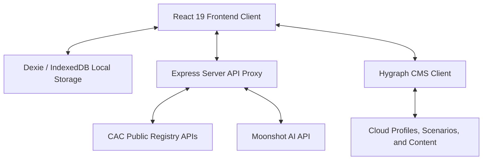

# Tax FYP 🇳🇬
> Smart Tax Calculation, Forecasting, and Compliance Platform for Nigerian Businesses

Tax FYP is a state-of-the-art, premium, offline-first tax intelligence and compliance platform specifically designed for Nigerian SMEs, limited liability companies, and sole proprietorships. It integrates directly with official registry APIs, uses AI to parse financial statements and classify expenses, provides intelligent forecasting models based on the **2025/2026 Nigerian Finance Act**, and automates compliance workflows.

---

## 🚀 Key Features

### 1. Automated Business Onboarding & CAC Integration
*   **Official Registry Lookup:** Directly queries the **Corporate Affairs Commission (CAC)** database through a secure proxy server.
*   **Auto-fill Profile:** Simply enter a CAC Number (e.g., `RC1234567`, `BN1234567`, `IT1234567`) to fetch company name, registration date, and legal type.
*   **TIN Generation & Retrieval:** Automatically pulls or simulates the retrieval of the tax identification number (TIN) associated with the registered CAC profile.
*   **Classification Engine:** Classifies the company under the correct tax bracket:
    *   **Small Company:** Annual Turnover < ₦25 Million (0% Company Income Tax)
    *   **Medium Company:** Annual Turnover ₦25 Million – ₦100 Million (20% Company Income Tax)
    *   **Large Company:** Annual Turnover > ₦100 Million (30% Company Income Tax)

### 2. Intelligent Computation Engine
Supports dynamic calculations for different tax classes in Nigeria:
*   **Company Income Tax (CIT):** Estimates taxable profit based on gross profit and allowable deductions.
*   **PAYE (Pay As You Earn):** Computes employee tax withholding based on salary and payroll sizes.
*   **Value Added Tax (VAT):** Calculates net monthly remittance liability (`Output VAT (Sales * 7.5%) - Input VAT (Purchases * 7.5%)`).
*   **Development & TETFund Levy:** Calculates the Tertiary Education Trust Fund (TETFund) Levy (2% of taxable profits for medium and large companies) and other development levies.
*   **Smart Validation:** Alerts users if expense-to-income ratios look abnormal or fail consistency checks before submitting calculations.

### 3. Expense Intelligence & AI Statement Parsing
*   **Bank Statement Uploader:** Supports PDF, CSV, Excel, and text bank statements.
*   **AI Financial Parsing:** Powered by **Moonshot AI (Kimi AI)**. The app securely uploads statements, extracts transactions, and identifies tax-allowable deductions.
*   **Auto-Reconciliation:** Categories are mapped to tax-relevant expense heads (Office Expenses, Asset Purchases, Utilities, Salaries, Professional Services, etc.) and marked with a confidence rating.
*   **Auditing Dashboard:** Filter transactions by status (`Verified`, `High Confidence`, `Needs Review`) to allow manual override and guarantee audit-proof tax records.

### 4. Strategic Scenario Planner
*   **Dynamic Sliders:** Allows modeling of Capital Expenditures (CAPEX) up to ₦200M and Revenue up to ₦500M.
*   **Pioneer Status Modeling:** Toggles tax-holiday exemption metrics (strategic sectors enjoy up to 7 years of 0% CIT and TETFund exemption under 2025 guidelines).
*   **Capital Allowance Shielding:** Models the tax shield generated by Asset Purchases (calculating the 25% annual depreciation offset against gross profit).
*   **Visual Analysis:** Compare current tax liabilities with simulated scenarios using interactive Recharts graphs.

### 5. Predictive Forecasting & Anomaly Alerts
*   **Annual Tax Projection:** Plots projected tax rates, monthly savings targets, and cumulative savings progress.
*   **Savings Assistant:** Recommends precise monthly savings goals to prevent cash-flow shocks at the end of the fiscal year.
*   **Anomaly & Risk Radar:** Flags financial anomalies (e.g., massive expense spikes, low margin alerts, mandatory VAT threshold violations) to mitigate audit risks.

### 6. Compliance Calendar & Forms Center
*   **Visual Deadline Calendar:** Highlight due dates (VAT due by the 21st, CIT annual returns due by March 31st).
*   **Checklist Pre-filing:** Integrated pre-filing steps such as income verification, depreciation checks, and expense reconciliation.
*   **Auto-Filled Tax Forms:** Pre-generates standard statutory forms (`VAT-001`, `CIT-001`, `PAYE-001`) with data gathered from transactions, complete with direct links to the **NRS Taxpayer Portal**.
*   **NRS Integration:** Aligned with the unified **Nigeria Revenue Service (NRS)** portal directives (replacing FIRS systems).

### 7. Tax Academy & Gamified Learning
*   **Educational Repository:** Bite-sized tutorials covering CIT, VAT, Deductions, Capital Allowances, and Tax Planning.
*   **Gamified System:** Earn XP rewards, level up, and unlock achievements/badges (`First Steps`, `Tax Novice`, `Streak Master`, `Tax Expert`, `Deduction Hunter`).
*   **Integrated Glossary:** Comprehensive tooltips explain technical jargon across all screens instantly (e.g., WHT, Stamp Duty, TETFund).

### 8. Context-Aware AI Chat Assistant
*   **Personalized Chatbot:** Interactive chatbot powered by Moonshot AI (`moonshot-v1-8k`) configured with system guidelines for simple English.
*   **Context-Aware Advice:** Tailors answers by referencing the user's active session data (revenue, company size, industry sector).
*   **Human Handoff:** Provides instant quick-actions to request a callback from a human accountant or send a pre-formatted email to the support desk.

---

## 🛠️ Architecture & Tech Stack

The application follows an offline-first architecture with background cloud synchronization.



### Frontend
*   **Framework:** React 19 (Functional Components, Hooks, Contexts).
*   **Language:** TypeScript (Strict Typings, Shared Interfaces).
*   **Styling:** Tailwind CSS v4 (Harmonious custom dark/light palettes, glassmorphism, responsive design).
*   **Visualization:** Recharts (Area charts, Bar charts, Line charts).
*   **Animations:** Framer Motion (Transitions, slide-outs, modal zooms).
*   **Icons:** Lucide React.
*   **Routing:** React Router DOM v7.

### Local Database
*   **Dexie.js (IndexedDB Wrapper):** Manages local client data storage including `profiles`, `transactions`, `receipts`, `invoices`, `employees`, `auditLogs`, and `chatMessages`. Supports exporting/importing JSON backups.

### Cloud Backend & Headless CMS
*   **Hygraph GraphQL Client:** Syncs user authentication, business profiles, saved scenario plans, tax returns, and drafts. Holds educational materials and guidelines.

### Server Proxy
*   **Express Standalone Server:** Prevents CORS/Cloudflare blockages by proxying CAC Search requests (`POST /api/cac-search`) and CAC Tax ID generation/retrieval (`GET /api/cac-tax/*`) to the official endpoints. Serves built files in production.

---

## ⚙️ Environment Setup & Configuration

Create a `.env` file in the root directory and configure the variables (refer to `.env.example`):

```bash
# Moonshot API Key (required for Receipt scanning & Bank statement parsing)
VITE_MOONSHOT_API_KEY=your_moonshot_api_key_here

# Hygraph headless CMS settings
VITE_HYGRAPH_CONTENT_API=https://eu-west-2.cdn.hygraph.com/content/YOUR_PROJECT_ID/master
VITE_HYGRAPH_PAT=your_hygraph_pat_here
VITE_HYGRAPH_MANAGEMENT_API=https://management-eu-west-2.hygraph.com/graphql
```

### Installation
Install the project dependencies:
```bash
npm install
```

### Running Locally
To launch both the Vite development server and the standalone Express API proxy server:

1. Start the Vite dev server (binds on port 3000):
   ```bash
   npm run dev
   ```
2. Start the Express backend server (binds on port 3000 or custom port):
   ```bash
   npm start
   ```

### Building for Production
Create the static bundle and serve it:
```bash
npm run build
```
Once built, starting the server via `npm start` serves the optimized production files from the `dist/` directory.

---

## 🧾 Summary of Tax Rules Applied (2025/26 Finance Act)

| Company Bracket | Annual Turnover | Company Income Tax (CIT) Rate | TETFund Education Tax | Allowable Deductions |
| :--- | :--- | :--- | :--- | :--- |
| **Small** | Under ₦25,000,000 | **0%** | **0%** | Yes, carries forward losses |
| **Medium** | ₦25,000,000 – ₦100,000,000 | **20%** | **2%** | Yes, 25% Capital Allowances |
| **Large** | Above ₦100,000,000 | **30%** | **2%** | Yes, 25% Capital Allowances |

*Note: VAT is remitted at a flat rate of **7.5%** monthly on applicable sales.*
